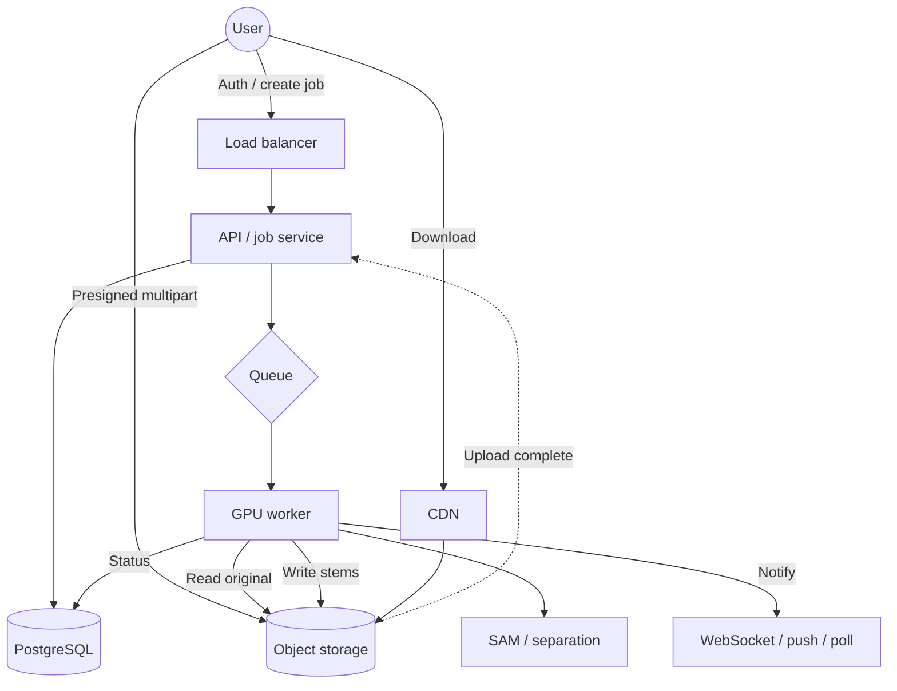
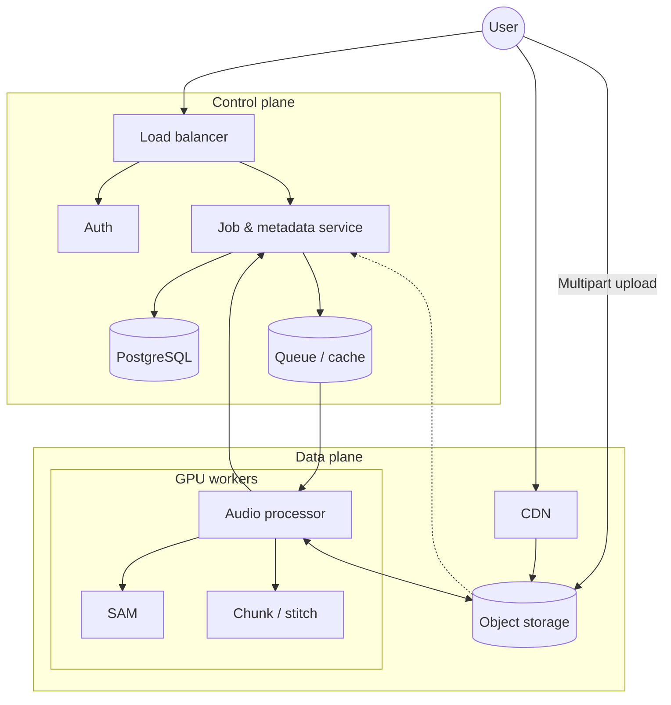

## Purpose of this post

- Capture the **outline** of a methodical system-design pass for a consumer **sound separation** app (working name: Shockwave / SplitSound).
- Order of work: **dimensions for questions** → **requirements & constraints** → **NFRs** → **scale** → **APIs** → **entities** → **high-level architecture** (Mermaid).
- Full prose and diagrams can follow in later parts.

---

## 1. Topics to frame questions (before core entities)

Use these **dimensions** so the design stays structured instead of a soup of what-ifs:

1. **Traffic & throughput** — RPS, spikes, thundering herd; load balancing, auto-scaling, rate limiting.
2. **Data size & storage** — Growth over time, payload size; SQL vs NoSQL, partitioning, indexing.
3. **Priority & QoS** — Critical vs background, premium “fast lane”; queues, fair queuing, tiers.
4. **Latency & performance** — p99 targets, bottlenecks; cache (CDN, Redis), async paths.
5. **Availability & reliability** — SLA, regional failure; redundancy, failover, DR.
6. **Security & compliance** — Encryption in transit/at rest, auth; regulatory fit (GDPR, HIPAA, etc.).

**Practical tip:** Start with **traffic** and **size**; **priority** and **availability** often follow once scale is clear.

---

## 2. Product slice: requirements, entities, flow (first pass)

### Requirements (user-facing)

- Import **audio/video** (consumer app, **~100 MB** max; real files often smaller or **chunked** for SAM-class models).
- Choose **which sounds to keep/remove**.
- **Download** separated tracks.
- **Retry** separation (ideally new **versions**, not silent overwrites).

### Core entities (refined for async + retries)

- **User** — identity, tier, limits.
- **Media asset** — original upload metadata + object storage pointer (not the blob in the DB).
- **Separation job** — async unit of work: status, settings JSON, retries, link to asset.
- **Stem / track** — outputs per job (vocals, drums, noise, etc.) + storage pointers.
- **Usage / audit** — credits, GPU time, guardrails for cost.

### Flow (happy path)

1. Upload completes (ideally **direct-to-object-storage**, not through API body).
2. User sets **frontend state** (toggles); on **Separate**, send **one payload** with `file_id` + `settings`.
3. API returns **202 + job_id**; worker runs SAM (or similar), writes stems, updates job.
4. Client **polls** or gets **push/WebSocket** when done; user downloads via **signed/CDN** URLs.

### CAP (Shockwave-shaped)

- **Partition tolerance** is assumed in distributed setups.
- **AP vs CP:** For this product, **AP** (availability + partition tolerance) is usually right: app stays up; **eventual consistency** on job status is acceptable vs going hard **CP** (banking-style strict consistency).

---

## 3. Non-functional requirements (interview-style checklist)

Frame as **constraints** before drawing boxes:

| Area | What to state |
|------|----------------|
| **Scalability** | Decouple **API** from **GPU workers**; scale workers on **queue depth**. |
| **Availability** | Target e.g. **99.9%**; multi-AZ; AP posture for status/history. |
| **Latency** | **Interactive** API sub-200 ms; **processing** minutes OK with async + progress. |
| **Reliability / durability** | No silent loss of uploads; **queue visibility timeout** + retries; idempotent job creation where possible. |
| **Cost** | **Auto-scale** workers down; **TTL** on blobs; spot/preemptible where safe. |
| **Security** | **JWT** + **ownership checks** on job/asset IDs; **signed URLs** for upload/download. |

---

## 4. Scale: from search volume to engineering numbers

**Inputs (example):**

- Monthly searches (sound/voice remover cluster): **~150k**.
- Funnel: CTR → visitors → conversion → **sessions × separations / month**.
- Derive: **jobs/day**, **peak multiplier** (e.g. 4×), **concurrency** needs (not just average RPS).

**Outputs to quote in a design review:**

- Peak **jobs/day** and rough **concurrent** separations.
- **Ingress/egress** storage math (original + N stems × job volume).
- **Worker count** from **job duration** and **parallelism** (e.g. one GPU ≈ X jobs/hour sequential).

**Reminder:** For heavy AI, **RPS** on the API is often modest; **queue backlog** and **GPU throughput** dominate.

---

## 5. API outline

### Media & jobs

- **Upload:** presigned URL or **multipart** init/complete (keep **100 MB** off API RAM).
- **Create job:** `POST /v1/jobs` → **202** + `job_id`; body includes `file_id`, model/workflow, **targets**, **settings** snapshot.
- **Status:** `GET /v1/jobs/{id}` (and optional `.../results` when completed).
- **Stems:** signed download URLs or **302** to CDN.
- **Retry/refine:** new job or **refine** sub-job; preserve **versions** where useful.

### User-facing

- **Auth:** OAuth/JWT; signup/login.
- **Profile / library:** list assets, delete (cascade delete **objects** in storage, not only DB rows).
- **Usage / quota:** credits, tier, resets.
- **Settings defaults:** `PATCH` profile so toggles are **state until submit**, then one payload on **Separate**.

### Cross-cutting

- **Idempotency** on “separate same file + same settings.”
- **Rate limits** on concurrent jobs per user (protect GPU spend).

---

## 6. High-level architecture (Mermaid — two views)

### A. End-to-end flow (async path)

### B. Control plane vs data plane (interview whiteboard style)

---

## 7. What this outline defers to later parts

- **Detailed ER diagram** and migrations.
- **Chunking + stitch** algorithm on workers.
- **Failure modes:** worker death, poison messages, DLQ.
- **Cost model** per GPU-hour and per GB-month.
- **Admin/ops** APIs and observability.

---

## Closing

This document is the **skeleton** for a longer write-up: same order you would use in a **system design interview**—clarify question dimensions, lock **NFRs** and **scale**, then **APIs**, **entities**, and **one or two** architecture diagrams before diving into implementation detail.
